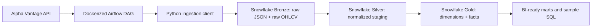
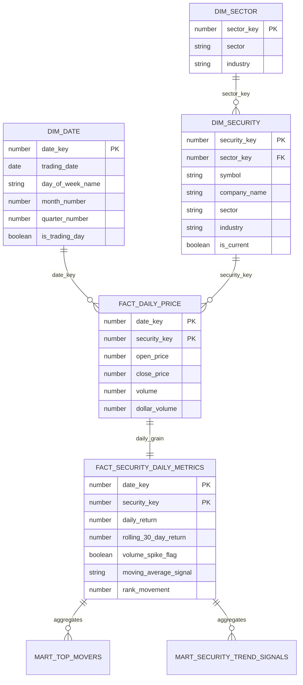
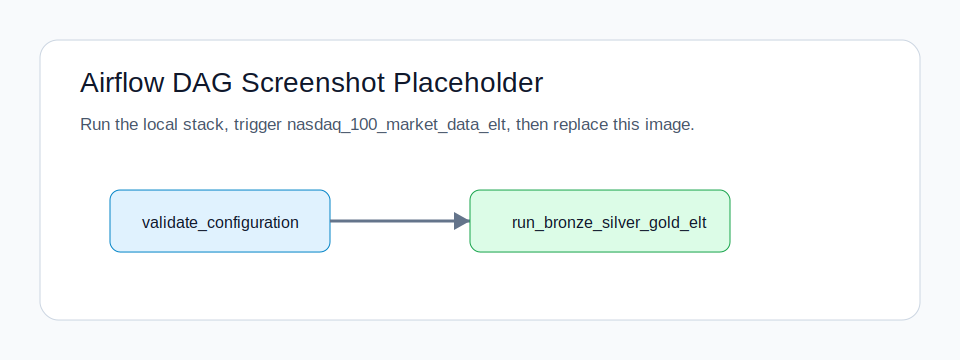

# Snowflake Nasdaq-100 Dimensional ELT

Dockerized Airflow ELT pipeline that ingests Nasdaq-100 daily market data from Alpha Vantage and loads a Snowflake dimensional warehouse. This project treats the original “Nasdaq 500” idea as **Nasdaq-100**, because Nasdaq-100 is the recognized Nasdaq large-cap index.

The goal is a recruiter-readable data engineering project: API ingestion, Snowflake Bronze/Silver/Gold modeling, dimensional facts, idempotent `MERGE` loads, data quality checks, orchestration, tests, and BI-ready marts.

## Tech Stack

- **Python / pandas** for API ingestion, normalization, and validation
- **Apache Airflow** for orchestration
- **Snowflake** for cloud data warehousing
- **Docker Compose** for local Airflow execution
- **pytest** for unit, SQL asset, DAG import, and optional Snowflake integration tests

## Data Source

- Ticker universe: seeded Nasdaq-100 starter list in `config/nasdaq100_symbols.csv`
- Market data: Alpha Vantage `TIME_SERIES_DAILY` endpoint
- Source constraints:
  - Alpha Vantage supports daily OHLCV equity data through the free API-key flow.
  - Nasdaq-100 index-level and premium vendor datasets may require paid access.
  - Free-tier API limits are handled with `NASDAQ_SYMBOL_LIMIT` and `ALPHA_VANTAGE_API_PAUSE_SECONDS`.

Sources:

- [Nasdaq-100 quotes and constituents page](https://www.nasdaq.com/market-activity/quotes/nasdaq-ndx-index)
- [Alpha Vantage API documentation](https://www.alphavantage.co/documentation/)
- [Snowflake SQLAlchemy documentation](https://docs.snowflake.com/en/developer-guide/python-connector/sqlalchemy)

## Architecture



## Dimensional Model



## Warehouse Layers

- **Bronze**: `BRONZE.RAW_API_RESPONSES`, `BRONZE.RAW_NASDAQ_DAILY_PRICES`
- **Silver**: `SILVER.STG_SECURITY`, `SILVER.STG_DAILY_PRICE`, `SILVER.STG_TRADING_CALENDAR`
- **Gold dimensions**: `GOLD.DIM_DATE`, `GOLD.DIM_SECURITY`, `GOLD.DIM_SECTOR`
- **Gold facts**: `GOLD.FACT_DAILY_PRICE`, `GOLD.FACT_SECURITY_DAILY_METRICS`
- **Gold marts**: `GOLD.MART_NASDAQ_MARKET_MOMENTUM`, `GOLD.MART_SECTOR_PERFORMANCE`, `GOLD.MART_TOP_MOVERS`, `GOLD.MART_SECURITY_TREND_SIGNALS`

## Quickstart

1. Create an environment file:

   ```bash
   cp .env.example .env
   ```

2. Add credentials:

   ```bash
   ALPHA_VANTAGE_API_KEY=your_alpha_vantage_key
   SNOWFLAKE_ACCOUNT=your-org-your-account
   SNOWFLAKE_USER=your_user
   SNOWFLAKE_PASSWORD=your_password
   SNOWFLAKE_ROLE=NASDAQ_ELT_ROLE
   SNOWFLAKE_WAREHOUSE=NASDAQ_ELT_WH
   SNOWFLAKE_DATABASE=NASDAQ_MARKET_DATA
   NASDAQ_SYMBOL_LIMIT=3
   ```

3. Create the Snowflake role, warehouse, and database using `docs/snowflake_setup.md`.

4. Start local Airflow:

   ```bash
   docker compose up airflow-webserver airflow-scheduler
   ```

5. Open Airflow at [http://localhost:8080](http://localhost:8080):

   - Username: `admin`
   - Password: `admin`
   - DAG: `nasdaq_100_market_data_elt`

6. Trigger the DAG. Airflow runs locally; Snowflake stores the warehouse layers.

## Airflow DAG Screenshot

Replace this placeholder after the first local run:



## Sample Analytics SQL

Top movers:

```sql
SELECT
    trading_date,
    symbol,
    company_name,
    mover_type,
    mover_rank,
    daily_return,
    rank_movement
FROM GOLD.MART_TOP_MOVERS
ORDER BY trading_date DESC, mover_type, mover_rank;
```

Market breadth:

```sql
SELECT
    trading_date,
    advancing_security_count,
    declining_security_count,
    average_daily_return,
    top_gainer_symbol,
    top_loser_symbol
FROM GOLD.MART_NASDAQ_MARKET_MOMENTUM
ORDER BY trading_date DESC;
```

Latest trend signals:

```sql
SELECT
    symbol,
    company_name,
    sector,
    trading_date,
    moving_average_signal,
    rolling_30_day_return,
    volume_spike_flag
FROM GOLD.VW_LATEST_SECURITY_SIGNALS
ORDER BY sector, symbol;
```

## Local Development

Install dependencies:

```bash
python3 -m venv .venv
source .venv/bin/activate
pip install -e ".[dev]"
```

Run tests:

```bash
pytest
```

Run optional Snowflake integration tests:

```bash
SNOWFLAKE_TEST_ENABLED=true pytest tests/test_snowflake_integration.py
```

## Resume Bullets

- Built a Dockerized Airflow ELT pipeline ingesting Nasdaq-100 daily OHLCV data from Alpha Vantage into a Snowflake Bronze/Silver/Gold warehouse.
- Designed a dimensional model with `DIM_DATE`, `DIM_SECURITY`, `DIM_SECTOR`, daily price facts, security metrics facts, and BI-ready market/sector/top-mover marts.
- Implemented Snowflake `MERGE` upserts, semi-structured `VARIANT` raw payload storage, validation checks, rolling-return metrics, volatility signals, and rank-movement analytics.
