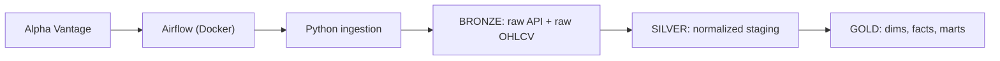
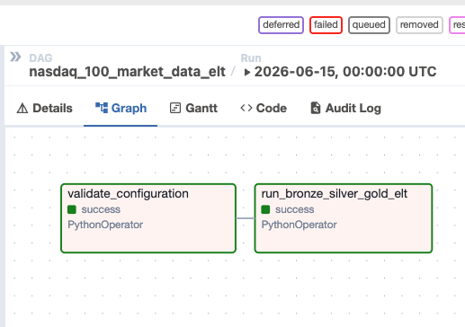

# Nasdaq-100 ELT to Snowflake

Small ELT project I built to practice Snowflake modeling end to end: pull
daily OHLCV for the Nasdaq-100 from Alpha Vantage, land it in Bronze,
normalize it in Silver, then build dims, facts and a few marts in Gold.

Airflow runs locally in Docker, Snowflake holds the warehouse, Python
does the API and transform work.

## Stack

- Python 3.11 — pandas, requests, SQLAlchemy
- Apache Airflow 2.9 — Docker, SequentialExecutor on SQLite (local only)
- Snowflake — XSMALL warehouse, fits the free trial
- pytest — unit, SQL asset, DAG import, optional Snowflake integration

## Architecture



## Warehouse layers

- **BRONZE** — `RAW_API_RESPONSES` (full JSON in a `VARIANT`), `RAW_NASDAQ_DAILY_PRICES`
- **SILVER** — `STG_SECURITY`, `STG_DAILY_PRICE`, `STG_TRADING_CALENDAR`
- **GOLD dims** — `DIM_DATE`, `DIM_SECURITY`, `DIM_SECTOR`
- **GOLD facts** — `FACT_DAILY_PRICE`, `FACT_SECURITY_DAILY_METRICS`
- **GOLD marts** — `MART_NASDAQ_MARKET_MOMENTUM`, `MART_SECTOR_PERFORMANCE`, `MART_TOP_MOVERS`, `MART_SECURITY_TREND_SIGNALS`

Loads are `MERGE` upserts keyed on `(symbol, trading_date)`, so reruns are idempotent.

## Setup

1. Copy the env file and fill it in:

   ```bash
   cp .env.example .env
   ```

   You need:
   - `ALPHA_VANTAGE_API_KEY` — free key from alphavantage.co
   - `SNOWFLAKE_ACCOUNT` (no `.snowflakecomputing.com` suffix), `SNOWFLAKE_USER`, `SNOWFLAKE_PASSWORD`
   - `NASDAQ_SYMBOL_LIMIT=3` for the first run — free tier rate-limits hard

2. Create the Snowflake role/warehouse/database. SQL is in
   [`docs/snowflake_setup.md`](docs/snowflake_setup.md).

3. Start Airflow:

   ```bash
   docker compose up airflow-webserver airflow-scheduler
   ```

   First boot pulls the Airflow image and pip-installs project
   requirements into the container — give it a few minutes.

4. Open <http://localhost:8080> (admin / admin), enable
   `nasdaq_100_market_data_elt`, trigger it.

## Airflow DAG



## Sample queries

Top movers:

```sql
SELECT trading_date, symbol, company_name, mover_type, mover_rank,
       daily_return, rank_movement
FROM GOLD.MART_TOP_MOVERS
ORDER BY trading_date DESC, mover_type, mover_rank;
```

Market breadth:

```sql
SELECT trading_date, advancing_security_count, declining_security_count,
       average_daily_return, top_gainer_symbol, top_loser_symbol
FROM GOLD.MART_NASDAQ_MARKET_MOMENTUM
ORDER BY trading_date DESC;
```

Latest trend signals per security:

```sql
SELECT symbol, company_name, sector, trading_date,
       moving_average_signal, rolling_30_day_return, volume_spike_flag
FROM GOLD.VW_LATEST_SECURITY_SIGNALS
ORDER BY sector, symbol;
```

## Local development

```bash
python3 -m venv .venv
source .venv/bin/activate
pip install -e ".[dev]"
pytest
```

Snowflake integration tests are off by default:

```bash
SNOWFLAKE_TEST_ENABLED=true pytest tests/test_snowflake_integration.py
```

## Notes / gotchas

- **Airflow 2.9 needs SQLAlchemy <2.0**, but `snowflake-sqlalchemy>=1.6`
  pulls in SQLAlchemy 2.x and breaks the Airflow ORM. The container's
  `requirements.txt` is pinned to `SQLAlchemy>=1.4,<2.0` and
  `snowflake-sqlalchemy>=1.5,<1.6`. The local venv (`pyproject.toml`)
  keeps the 2.x line because it doesn't run Airflow. If you change one,
  rebuild the container.
- The free Alpha Vantage tier is ~5 calls/min. With
  `NASDAQ_SYMBOL_LIMIT=3` and the default 12.5s pause the run fits
  inside the quota. Bump the limit only after you've upgraded the key.
- Metadata DB is SQLite + SequentialExecutor. Fine for one user on a
  laptop; don't try to scale this without Postgres + a real executor.

## Roadmap

- [ ] Swap SequentialExecutor → LocalExecutor with Postgres metadata
- [ ] Backfill DAG (currently `LOAD_START_DATE` is the lower bound)
- [ ] dbt project on top of the Silver layer
- [ ] Streamlit dashboard reading from the Gold marts
